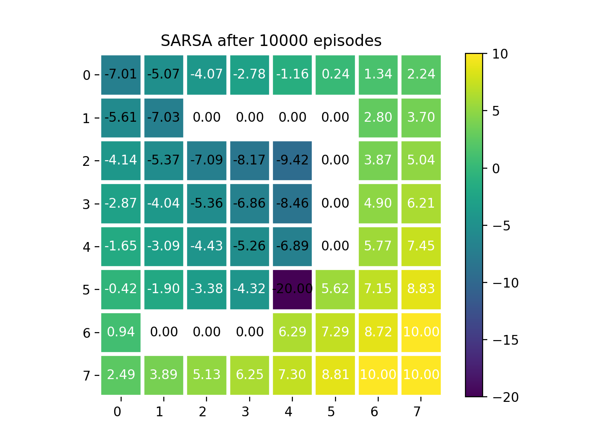
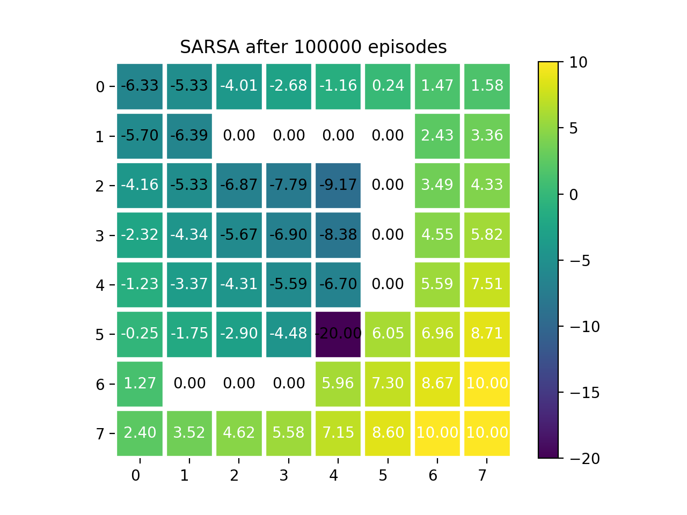
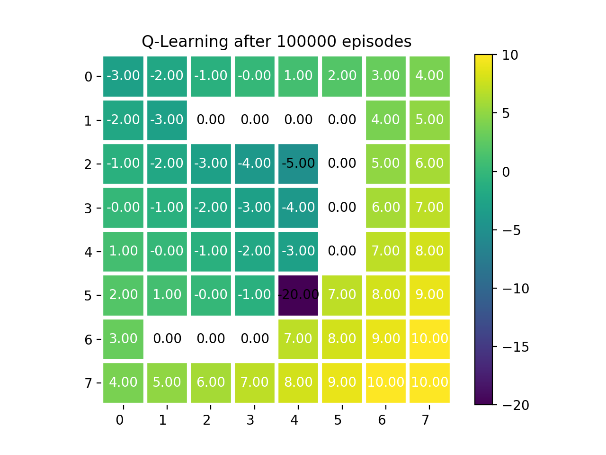

# uva-mas-18

## 6.8 SARSA and Q-Learning for Gridworld Example

This little project compares SARSA and Q-Learning for a homework assignment of 
Multi Agent Systems (Sept 2018) at UvA.

Both use epsilon greedy as policy with `eps = 0.2` and learning rate `alpha = 0.1`. From the assignment given is a reward for `-1` for every step and rewards of `-20` for falling into the pit and `+10` for reaching the goal.

Comparing the plots from 10,000 and 100,000 episodes you can easily see that SARSA's values are still changing while Q-Learning already converged. This demonstrates the faster convergence of Q-Learning. The diagrams showing the value function `v(s) = max q(s,a)` for all states. Even without converges acting greedy gives the optimal policy after (less than) 10,000 episodes.

### SARSA after 10,000 and 100,000 episodes

### Q-Learning after 10,000 and 100,000

