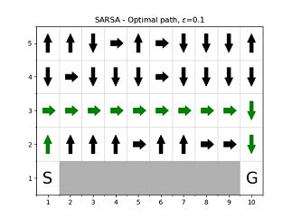

# Multi-Agent Systems, University of Amsterdam, 2018

## 6.9 Cliff Walking

We compare SARSA and Q-Learning for this so-called 'Cliff Walking' experiment.

We compare them using different epsilon-greedy policy, more precisely - `eps=0.1`, `eps=0.4`, `eps=0.65`. For greater epsilon, the policy becomes indifferent between going out of the bounds so we are not looking into those values.

We are also using learning rate of `alpha=0.1` and discount rate of 1, i.e. the game is un-discounted. We are running 500 episodes and for the rewards sum we are taking into account the moving average so we can smooth the graph that we plot.

 

 

 

We see that with greater epsilon-greedy policy, the optimal path for SARSA goes further away from the cliff, while the Q-Learning path remains unchanged